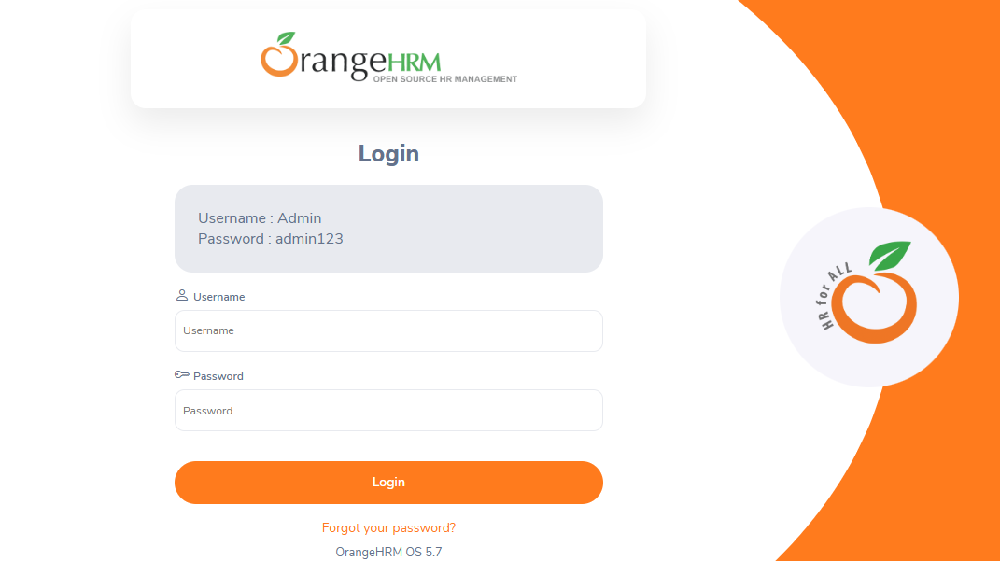

# 🕸️ OrangeHRM Automation Framework

## 📌 Overview
**OrangeHRM** 
is an open-source Human Resource Management (HRM) software widely used by companies to handle:
  - 👤 Employee information management
  - 🎯 Recruitment and onboarding
  - ⏱ Time and attendance tracking
  - 🌴 Leave/vacation management
  - 📈 Performance reviews

This project is a **robust Test Automation Framework** designed to validate the **end-to-end functionality of OrangeHRM**.  
Built with scalability and reusability in mind, it ensures that all critical modules work seamlessly while reducing manual testing effort.

---

Performance reviews# **OrangeHRM**  
## 

## ✨ Key Highlights
- 🔐 **Login & Security** – Verifies user authentication with valid/invalid credentials.
- 🏢 **Admin Module** – Automates adding, searching, editing, and deleting system users with role validation.
- 👤 **PIM (Personal Information Management)** – Automates employee lifecycle actions such as creation, update, search, and removal.
- 📊 **Dashboard & Navigation** – Ensures all core menus and links function correctly.

## 

---

## ⚙️ Tech Stack & Tools 🔑 Features
 🛠 Framework Features
  ☕ **Java Language** – Strongly typed, object-oriented, and widely used for test automation.
  🧩 **Page Object Model (POM)** – Clean, modular, and reusable code structure for better maintainability.
  🧪 **TestNG Integration** – Structured test execution with grouping, parallel runs, and reporting.
  📂 **Data-Driven Testing (JSON)** – Flexible test data management for scalability and variation handling.
  🎨 **Fluent Design Pattern** – Enhances code readability with chainable, human-like test steps. 

## 📌 Project Status
⚠️ **Under Development** – New features and modules are being continuously enhanced. 